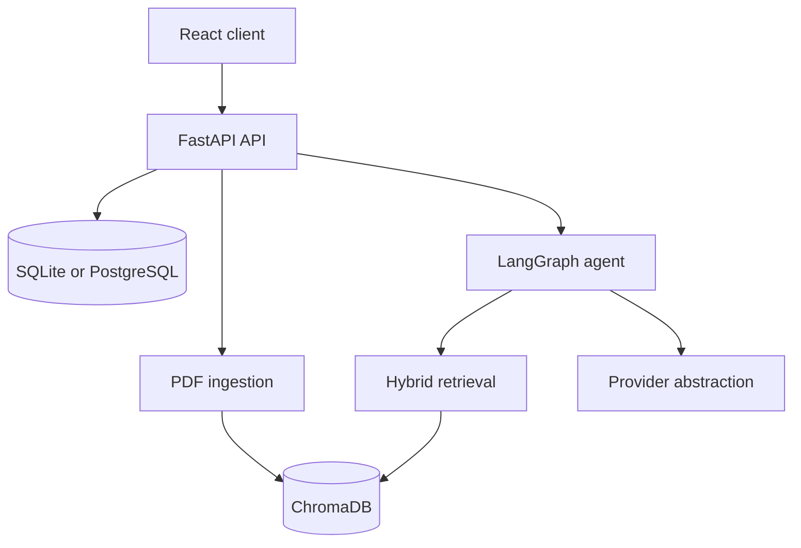
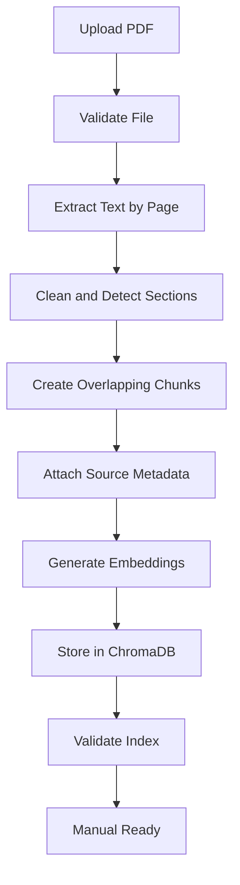
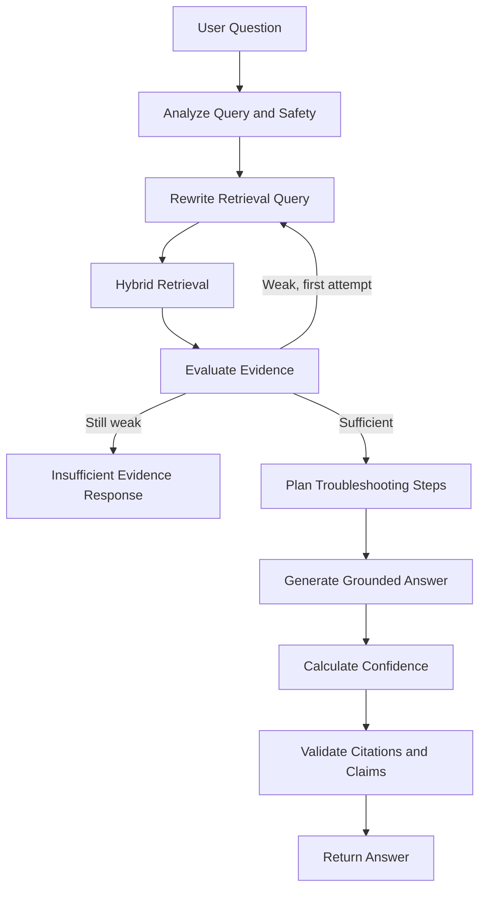

# EquipAssist AI  Equipment Troubleshooting RAG Assistant


https://github.com/user-attachments/assets/b164b806-2ddb-4d6d-9330-9718fbc4e58a


> Submission project: an agentic RAG assistant that ingests equipment manuals as PDF, answers error-code and symptom questions with step-by-step troubleshooting, source citations, and an explainable confidence score.

A production-oriented MVP that ingests PDF equipment manuals and returns safe troubleshooting with real page citations and an explainable confidence score.

## Features

- Multi-PDF upload, SHA-256 duplicate protection, live status, reprocessing, and SQL/vector cascade deletion
- Page-aware extraction, section detection, overlapping chunks, optional OCR interface, and Chroma persistence
- Hybrid vector, BM25-style, and exact identifier retrieval with metadata filters and reranking
- LangGraph workflow with safety classification, two-attempt retrieval, evidence evaluation, planning, generation, confidence, and citation validation
- Groq generation with a deterministic local test provider
- Local deterministic embeddings; tests make no paid calls
- JWT login and registration with bcrypt password hashing
- A backend-only Groq API key loaded from environment configuration; the key is never requested or displayed in the UI
- Render free-tier Blueprint for the API, static frontend, and PostgreSQL
- SQLite locally, PostgreSQL-compatible SQLAlchemy, Alembic, SSE, Docker, Swagger, and a premium responsive React UI
- Persistent light/dark theme changer with system-theme detection and localStorage preference

## Screenshots

Run the app and capture the landing page, manual page, and troubleshooting chat for submission screenshots.

## Architecture



### Ingestion pipeline



### Agent workflow



## Repository structure

```text
backend/app/{api,agents,core,db,models,schemas,services}
backend/tests                 deterministic unit and integration tests
frontend/src                 React pages, components, API and custom CSS
sample_data                  original PX-200 Markdown/PDF and Q&A cases
scripts                      sample PDF, ingestion and evaluation commands
docs                         architecture, ingestion and confidence notes
storage                      uploaded manuals and persistent Chroma data
```

## Local installation

Python 3.11+, Node 20+ and npm are required. A virtual environment is optional. On Windows without a virtual environment, use `py -3.11` for every Python command. The sample scripts add `backend/` to `sys.path` automatically, so they can be run from the repository root.

```bash
cp .env.example .env
python3.11 -m pip install -r backend/requirements.txt
cd frontend && npm install && cd ..
python3.11 scripts/build_sample_pdf.py
```

### Windows PowerShell (Python 3.11, no virtual environment)

```powershell
copy .env.example .env
py -3.11 -m pip install -r backend\requirements.txt
py -3.11 scripts\build_sample_pdf.py
```

For free local operation, retain `LLM_PROVIDER=local` and `EMBEDDING_PROVIDER=local`. Development/test instances generate per-process JWT/encryption secrets when those variables are blank. Production/staging must provide explicit secrets in the environment.

## Database initialization

Tables are created on startup. For managed migrations:

```bash
cd backend
PYTHONPATH=. alembic revision --autogenerate -m "initial schema"
PYTHONPATH=. alembic upgrade head
```

Use a SQLAlchemy PostgreSQL URL in `DATABASE_URL` for PostgreSQL.

## Start backend and frontend

```bash
cd backend
PYTHONPATH=. uvicorn app.main:app --reload --host 0.0.0.0 --port 8000
```

Windows PowerShell:

```powershell
cd backend
py -3.11 -m uvicorn app.main:app --reload --host 127.0.0.1 --port 8000
```

In another terminal:

```bash
cd frontend
npm run dev
```

Open `http://localhost:5173`. Swagger is at `http://localhost:8000/docs`.

## Docker

```bash
docker compose up --build
```

## Ingest the sample manual

With the API running:

```bash
PYTHONPATH=backend python scripts/ingest_sample_manual.py
```

Or upload `sample_data/PX-200_manual.pdf` in the Manuals page with model `PX-200`.

## Example API request

```bash
curl -X POST http://localhost:8000/api/v1/chat/query \
  -H 'Authorization: Bearer ACCESS_TOKEN' \
  -H 'Content-Type: application/json' \
  -d '{"question":"What does E05 mean and how should I troubleshoot it?","manual_ids":["MANUAL_UUID"],"equipment_model":"PX-200","top_k":6}'
```

## Three sample demonstrations

The submission includes a real sample manual, three evaluation questions, and a citation-bearing answer sheet in `docs/sample_qa.md`. The runtime evaluation in `scripts/evaluate_sample_questions.py` performs real API retrieval and checks that returned citations correspond to the expected manual sections/pages.

1. **E05 — Motor Overtemperature:** exact error-code retrieval, safety evidence, troubleshooting and escalation.
2. **E12 — Low Hydraulic Pressure:** symptom + exact-code retrieval across multiple manual sections.
3. **Emergency Shutdown:** semantic retrieval of the emergency procedure and technician escalation section.

Unknown and irrelevant questions are expected to use the insufficient-evidence path instead of inventing repair instructions.

## Confidence score

`30% retrieval similarity + 25% reranker relevance + 20% citation coverage + 15% evidence agreement + 10% exact identifier match`

Penalties: −15 for one useful chunk, −20 for missing model specificity, and −25 for conflicting evidence. Indirect evidence caps at 55%; identifier-specific questions without an exact match cap at 40%. High is 85–100, Medium 65–84, Low 0–64.

## RAG validation

The project treats RAG quality as a separate acceptance criterion. A successful HTTP response is not enough. Evaluation checks exact and paraphrased retrieval, expected sections/pages, citation presence, citation support, confidence, and insufficient-evidence behavior.

```bash
PYTHONPATH=backend python scripts/evaluate_sample_questions.py
```

Windows PowerShell:

```powershell
$env:PYTHONPATH="$PWD\backend"
py -3.11 scripts\evaluate_sample_questions.py
```

The three submission Q&A demonstrations with human-readable citations are in `docs/sample_qa.md`.

## Tests

```bash
python scripts/build_sample_pdf.py
cd backend
PYTHONPATH=. pytest -q
```

Coverage includes PDF extraction, chunking, metadata, identifier detection, exact retrieval, confidence penalties, weak-evidence rejection, duplicates, SQL/vector deletion, chat success, invalid PDFs, and provider fallback.

## Evaluation

After sample ingestion:

```bash
PYTHONPATH=backend python scripts/evaluate_sample_questions.py
```

Windows PowerShell:

```powershell
$env:PYTHONPATH="$PWD\backend"
py -3.11 scripts\evaluate_sample_questions.py
```

Reports retrieval hit rate, retrieved pages, citation presence, groundedness gate, confidence, and response time.

## Provider switching

Generation providers supported by the application:

- Local deterministic provider: `LLM_PROVIDER=local` (offline demo/test path)
- Groq: `LLM_PROVIDER=groq` plus `GROQ_API_KEY`
- OpenAI: `LLM_PROVIDER=openai` plus `OPENAI_API_KEY`
- Anthropic: `LLM_PROVIDER=anthropic` plus `ANTHROPIC_API_KEY`

Embeddings currently use the deterministic local provider so the sample can be evaluated without paid embedding calls.

Restart after changes. Startup validation reports missing keys and never makes a paid call.

### User-provided free API keys

After registering, set `GROQ_API_KEY` in the backend environment. The browser never receives, requests, stores, or displays the Groq key. and decrypts it only while creating that user's provider client. Generate `APP_ENCRYPTION_KEY` locally with:

```bash
python -c "from cryptography.fernet import Fernet; print(Fernet.generate_key().decode())"
```

When `LLM_PROVIDER=groq`, the application uses Groq with `llama-3.3-70b-versatile`. The key is backend-only.

## Render free-tier deployment

1. Push this repository to GitHub.
2. In Render, choose **New → Blueprint** and select the repository. Render reads `render.yaml`.
3. Set `APP_ENCRYPTION_KEY` on the API service using the Fernet command above.
4. Set API `FRONTEND_URL` to the deployed static-site origin, for example `https://equipassist-web.onrender.com`.
5. Set frontend `VITE_API_BASE_URL` to the API URL plus `/api/v1`, for example `https://equipassist-api.onrender.com/api/v1`.
6. Redeploy both services after setting the variables.

Render free web services use an ephemeral filesystem. User accounts and encrypted keys persist in PostgreSQL, but uploaded manuals and local Chroma indexes must be re-uploaded after a backend restart or spin-down. Free Render PostgreSQL also expires after its current free retention window. Use paid persistent storage or an external object/vector store for permanent production data.

## Troubleshooting

- Insufficient extractable text: upload a text PDF or implement `OCRService`.
- HTTP 409: use the existing manual's reprocess action.
- Empty retrieval: confirm status is indexed and select the correct manual/model.
- Provider error: verify key/model access or switch to local.
- CORS error: make `FRONTEND_URL` match the browser origin.

## Known limitations and future work

The OCR interface has no bundled engine. Local hash embeddings are less semantic than production embeddings. The MVP reranker is lexical. Settings are environment-managed. Before public multi-tenant deployment add PaddleOCR, a cross-encoder reranker, committed release migrations, background workers, object storage, authentication/RBAC, rate limiting, malware scanning, tracing, page preview, and technician feedback.
